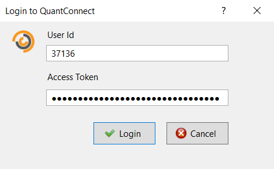
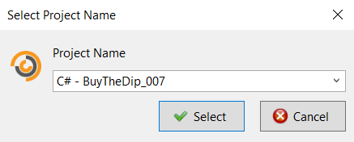
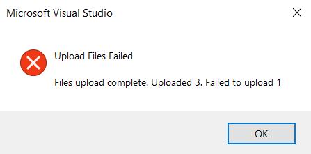
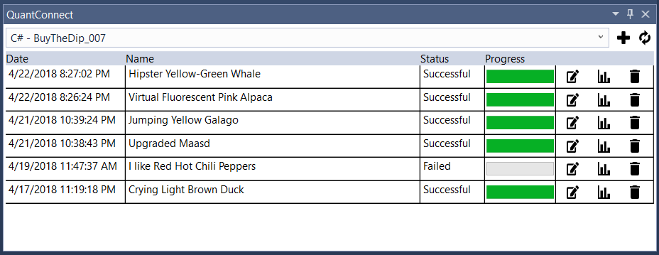
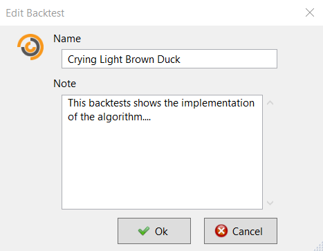
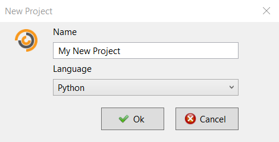

 Visual Studio Plugin
=========

## Introduction ##

The plugin is a tool which allows a QuantConnect user to integrate with the platform through the Visual Studio IDE. Providing different [features](#Features), it aims to facilitate strategy development.

## Installation Instructions ##

Visual Studio 2015 & 2017 are supported.

### Build

- Select **‘Release’** solution configuration
- Right click project ‘QuantConnect.VisualStudioPlugin’ and select **‘Rebuild’**
- Verify in the Visual Studio ‘Output’ panel compilation succeeded with no errors

### Install

- Uninstall previous version if present
   > ‘Tools’ menu → ‘Extensions and Updates...’ → ‘Installed’ search for ‘QuantConnect.VisualStudioPlugin’ and uninstall
- Close Visual Studio
- Navigate to ‘..\Lean\VisualStudioPlugin\bin\\**Release**’
- Execute ‘QuantConnect.VisualStudioPlugin.vsix’

### Setup

- Login to [https://www.quantconnect.com/][1] and navigate to [‘My Account’][2] page
- In the Api panel, you will find your a ‘unique access token’ and your ‘user id’ which are required to connect to the API.
- From the Visual Studio IDE go to ‘Tools’ menu → ‘QuantConnect’ → ‘Login’. Enter your Api credentials and login.
	> 

>**Manually logging in is only required the first time**. The plugin will automatically login, using previous valid credentials, when required.

## <a name="Features">Features</a>

Currently the plugin can **save files** to a **project**, **compile** and **backtest** it. Also, through the [tool window](#ToolWindow), it can:
- **Delete**, **rename**, **open** or add a **note** to a previous backtest
- Create a **new project**.

### Save to QuantConnect

This feature allows the user to upload to QC, one or more files to a target project.

- Select the desired files
- Right click → **‘Save to QuantConnect’**
- Select target project
	> 
- Result:
	- If the operation succeeded: the user will be informed through the **VS Status Bar**
	- If any error occurs: the user will be informed through **VS Status Bar** and with a **popup box**.
		> The error message will provide details about the operation result.
		> 
		> 

### <a name="SendForBacktesting">Send for Backtesting</a>

This feature allows the user to upload to QC one or more files to a target project, compile it and backtest it.

- Select the desired files
- Right click → **‘Send for Backtesting’**
- Select target project
- Result:
	- If the operation succeeded: the user will be informed through the **VS Status Bar** and the target QC project will be **opened** using the default **browser**.
	- If any error occurs: the user will be informed through **VS Status Bar** and with a **popup box**.
		> If the error is due to a **compilation error**, popup box will contain the first compilation error.
		>
		> 

		> If the error is due to a **run-time issue** during the backtest process, popup box will contain error details and the corresponding stack trace.
		>
		> 

## <a name="ToolWindow">Tool Window</a>

This utility allows the user to monitor ongoing backtests and perform different [actions](#Actions) over previous ones.
>Given the user selects project ‘BuyTheDip_007’ in the tool windows combo box and launches a backtest using [‘Send For Backtesting’](#SendForBacktesting) for ‘BuyTheDip_007’ project, it will display the backtests progress.
>
> 

##### How To Open
- From the Visual Studio IDE go to ‘View’ menu → ‘Other Windows’ → ‘QuantConnect’
	> If there are previous valid credentials, the tool window will auto login when open or when the user performs an [action](#Actions).
##### <a name="Actions">Available Actions</a>
- Delete backtest
- Open backtest
- Edit backtest: allows the user to edit the backtests name and note
	> 
- Refresh: it will load or reload, available projects
- New Project
	> 

## Troubleshooting

VisualStudio plugin writes log data to the VisualStudio activity log, but only if VisualStudio is started with the `/log` parameter passed to it. To debug the QuantConnect plugin start VisualStudio with the following command:

```
devenv /log <path-to-log>
```

[For more information][3]


[1]: https://www.quantconnect.com/
[2]: https://www.quantconnect.com/account/
[3]: https://docs.microsoft.com/en-us/visualstudio/ide/reference/log-devenv-exe